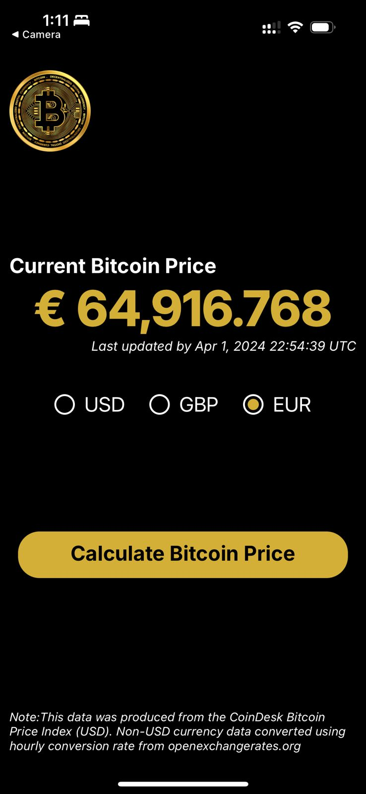
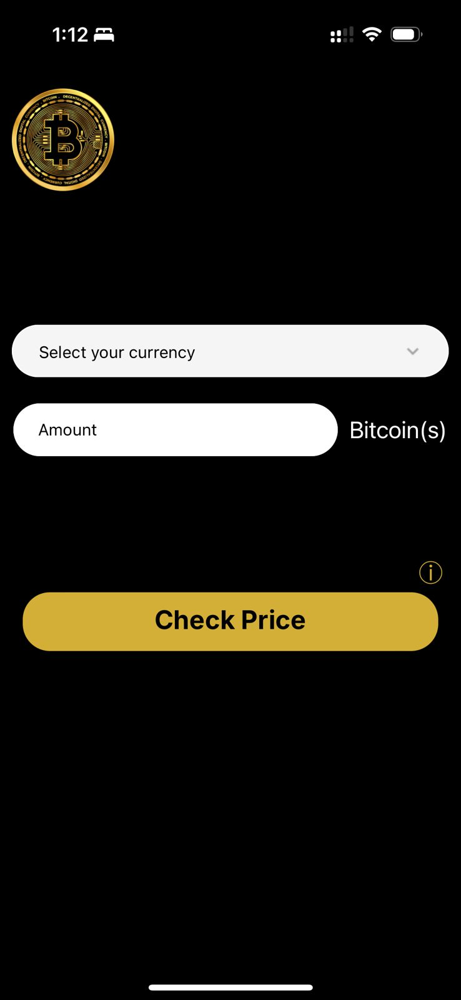

# Bitcoin Price Calculator

Stay up-to-date with real-time Bitcoin prices in EUR, GBP, and USD, while effortlessly converting to your preferred currency. Track fluctuations and make informed decisions with ease.


## Prerequisites

You need Node installed locally and any dependencies that may be required to run React Native
## Run Locally

Clone the project

```bash
  git clone https://github.com/ShanuJo/BTCPriceApp.git
```

Go to the project directory and start the server

```bash
  npx expo start
```

Scan the QR Code

```bash
 After scan the QR code you can test the app Locally
```


## API Reference

#### Coindesk API

```http
  GET https://api.coindesk.com/v1/bpi/currentprice.json
```

#### Currency Conversion API by API Plant

```http
  GET https://api.getgeoapi.com/v2/currency/convert
```
| Parameter | Type     | Description                |
| :-------- | :------- | :------------------------- |
| `api_key` | `string` | **Required**. Your API key |
| `amount` | `string` | Provide bitcoint amount |
| `From` | `string` | Selected Currency  |
| `To` | `string` | Desired Currency|


## Screenshots 




